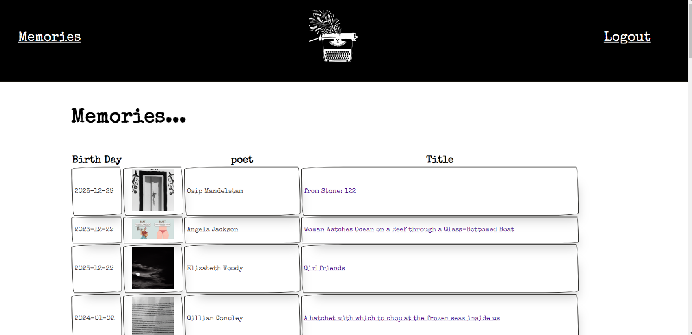

# The Muse Machine
For the poetry-lover/AI-enthusiast (an evergrowing market), the Muse Machine: An AI-image-powered-poem-of-the-day application that retrieves a random poem from a massive database of both modern and classic poems, uses AI to summarize the poem, and then calls on DALL-E to generate a unique image based on the poem's contents. Each creation is unique and saved in a PostgreSQL database, with image hosting powered by Cloudinary. Logged in users can ponder their past creations in the Memories section. 

## Technology Stack
* Front-end Framework: Vue.js
* Back-end Language: Java
* Back-end Framework: Spring Boot
* Authentication: JWT
* Database: PostgreSQL

## Future Development
* Host:
  * Host front-end on a static site hosting provider like Netlify
  * Host back-end using AWS Lambda functions
  * Host PostgreSQL database with AWS RDS
* Allow users to change prompt generation parameters (art style, AI temperature)
* Allow users to pick from a series of 4 cryptic cards with crude drawings, each of which will correspond to genres/themes of poems in the database and return a poem from that category
* Restrict logged-in users to 1 creation per 24 hours
* Admin access to view creations of all users
* An About Me page where The Muse Machine explains its mission and purpose in poem form

## Screenshots

---

---

---

---

