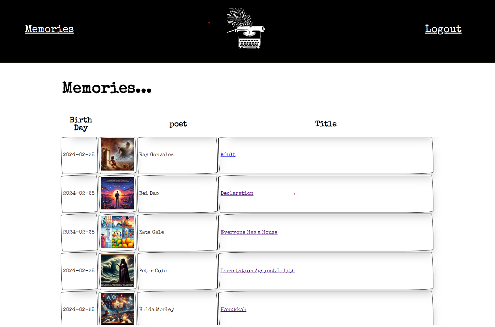

# The Muse Machine
For the poetry-lover/AI-enthusiast (an evergrowing market), the Muse Machine: An AI-image-powered-poem-of-the-day application that retrieves a random poem from a massive database of both modern and classic poems, uses AI to summarize the poem, and then calls on DALL-E to generate a unique image based on the poem's contents. Each creation is unique and saved in a PostgreSQL database, with image hosting powered by Cloudinary. Logged in users can ponder their past creations in the Memories section. 

# Live Site
https://themusemachine.netlify.app/

## Technology Stack
* Front-end Framework: Vue.js
* Back-end Language: Java
* Back-end Framework: Spring Boot
* Authentication: JWT
* Database: PostgreSQL
* Hosting: Netlify, AWS API Gateway, AWS Lambda Functions, AWS RDS

## Future Development
* Hosting:
  * ~~Host front-end on a static site hosting provider like Netlify~~
  * ~~Host PostgreSQL database with AWS RDS~~
  * ~~Host back-end using AWS Lambda functions~~
    * ~~Optimize cold starts (3/7/24)~~
* Usability
  * ~~Responsive design~~
  * ~~Add loading screen (3/7/24)~~
  * Add pagination to Memories for better performance
* New Features:
  * Allow users to change prompt generation parameters (art style, AI temperature)
  * Allow users to pick from a series of 4 cryptic cards with crude drawings (like Taro cards or whatever), each of which will correspond to genres/themes of poems in the database and return a poem from that category
  * Restrict users to 3 creations per hour
  * Admin access to view creations of all users
  * An About Me page where The Muse Machine explains its mission and purpose in poem form
  * Users can 'Favorite' memories
  * Users can share memories to public 
  * Users can see shared memories and upvote or downvote

# Broad Future Plan
The intent of this project was to see if I could get a pre-existing project up with AWS Lambdas. That has been a success. However, currently, keeping an entire spring boot application in a Lambda function is not ideal. Future plans are to slowly offload functionality to other AWS tools (JWT authentication to Cognito, Cloudinary image hosting to an S3 bucket), eventually replacing Spring Boot-integrated Lambda with faster, lighter more specified javascript Lambda functions. 

## Screenshots

---

---

---

---

